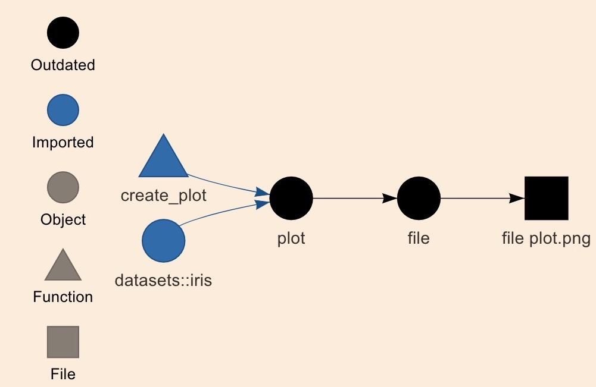
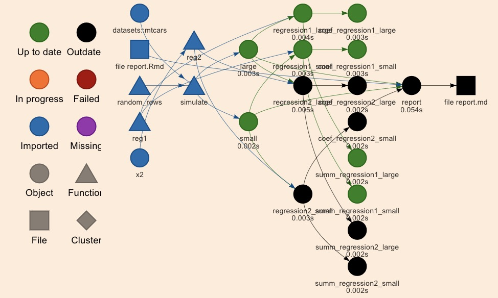
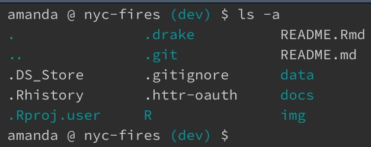
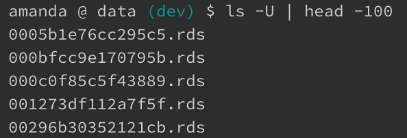

```{r setup, include=FALSE, warning=FALSE}
library(knitr)
library(kableExtra)
opts_chunk$set(echo = TRUE, eval = TRUE, collapse = TRUE, cache = TRUE)
options(htmltools.dir.version = FALSE)
options(knitr.table.format = "html")
```


##  Warning: this presentation contains less rap than you might have expected. 

--

<br>

.center[I won't blame you if you want to make a quick getaway.]

--

<p align="center">

</p>

<!-- .center[] -->

---

class: inverse

## Quick About Me

<br>

.left-column[

**Day job**: ultimate frisbee player


**For fun**: Data Scientist at [Earlybird Software](http://www.earlybird.co/), former co-organizer of [R-Ladies Chicago](https://rladieschicago.org/)

<!-- .pull-left[] -->

**GitHub**: [@aedobbyn](https://github.com/aedobbyn)

**Website**: https://dobb.ae

**Twitter**: [@dobbleobble](https://twitter.com/dobbleobble)

]

.right-column[]

---

## The Plan

I'll give an intro to what `drake` is and how it works.

--

<br>

Then we'll switch to a [live coding Rmd](https://github.com/aedobbyn/nyc-fires/blob/master/live_code.md) which hopefully won't totally break `r emo::ji("crossed_fingers")`

--

<br>

In that part, we'll use the Twitter and Google Maps geocoding APIs to run a `drake` pipeline.

---

## `drake`'s Main Idea

--

[`drake`](https://github.com/ropensci/drake) is workflow manager for your R code.

--

In a complex analysis pipeline, it makes changing your code easier.

--

<br>

`drake` loves changes.

--

<p align="left">

</p>

---

## `drake`'s Main Idea

*What that means*: 

--

When changes occur that make the most recent results **out-of-date**, `drake` rebuilds *only* the parts of the pipeline that need to be rebuilt.

<p align="left" style="padding-right: 20%;">

</p>

--

Created and maintained by [Will](https://twitter.com/wmlandau) [Landau](https://github.com/wlandau) and friends.

---

## What's the deal with the name?

--


**`d`**`ataframes in` 

**`R`** `for` 

`M`**`ake`**

<br>


--

.pull-left[

[GNU Make](https://www.gnu.org/software/make/) is a tool that uses file called a Makefile to specify **dependencies** in a pipeline. 

<br>

`drake` implements that idea in a way that's more native to how we work in R.

]

           Example of a Makefile:

.pull-right[]


---

class: inverse

## Better Workflows

<br>

Does your analysis directory look like this?

--

.pull-left[

<br>

`01_import.R`

`02_clean.R`

`03_deep_clean.R`

`04_join.R`

`05_analyze.R`

`06_analyze_more.R`

`07_report.Rmd`
]

--

.pull-right[

<br>

#### What's bad about this?

<br>


**It doesn't scale well**

<br>

Which you know if you've tried to add another intermediate step or reorganize your subdirectories.

]

---

#### Your pipeline depends on

--

- You knowing when the input data changes 

--

- You knowing which objects and functions are used by which other objects and functions

--

- You keeping file names up-to-date and sourcing things in the right order
<!-- - Explicitly saving intermediate data representations -->

--

<br>

#### If something breaks

--

- Can you be sure about where it broke?

--

- Do you know which intermediate data stores are up to date?

--

- Do you need to re-run the entire pipeline again? 

--

.pull-right[

<p align="right">

</p>

]


---

## Nice features of `drake`


.pull-left[

1) See how your pipeline fits together, in a tidy **dataframe**

<br>

]

--

2) Visualize your pipeline's **dependency graph** 


.pull-right[] 

<br>
<br>

--

.pull-left[

3) Great for iteration and **reproducibility**; you know exactly how these results were generated 

]

<br>
<br>
<br>
<br>
<br>

--

.pull-left[

4) High-performance computing advantages

]

<br>
<br>
<br>
<br>

--

.pull-left[

5) It's all in R so no writing config files! `r emo::ji("tada")`

<br>

]

<!-- .pull-right[] -->


---

## `drake` : `knitr`

(Analogy stolen from Will's point in his [interview on the R podcast](https://www.youtube.com/watch?v=eJQ29CLyDCs&feature=youtu.be&t=1533).)

<p align="center">

</p>

--


1) `knitr` can **cache** chunks if they've already been run, and nothing in them has changed.

--

2) A chunk successfully knitting **depends** on the previous chunk knitting and on any chunk that you specify a [`depedson`](https://twitter.com/drob/status/738786604731490304?lang=en) for.

--

3) Report lives in a single file, making that part reproducible and **compact**. 


???
With knitr, you expect to be able to rerun someone's report from a single file.

---

## Is this also kinda like memoising?

--

Yes!

--

But better.

--

Memoising **caches the return value of a function for a given a set of arguments**

--

<br>

- If the function is called again with the *same* set of arguments, the value is pulled from the cache instead of recomputed
  - Saves time & resources `r emo::ji("thumbsup")`

--
  
<br>

- In R implemented nicely in the [`memoise` package](https://github.com/r-lib/memoise)

---

## On Memoising

The downside:

**Memoising only applies to one function.**

--

<br>

What if a function upstream of the memoised function changes? We could get the wrong answer.

--

<p align="center">

</p>


---

## On Memoising

```{r}
add <- function(a, b) {
  a + b
}

add_and_square <- function(a, b) {
  add(a, b) ^ 2
}
```

--

<br>

```{r}
add(2, 3)
add_and_square(2, 3)
```


---

## On Memoising

If we've memoised `add_and_square`,

```{r}
add_and_square <- memoise::memoise(add_and_square)
```

--

we return `add_and_square(2, 3)` from the cache. (Yay, fast!)

```{r}
add_and_square(2, 3)
```

<br>

--

**But** if we now redefine `add` so that it *subtracts* `b` from `a`...
```{r}
add <- function(a, b) {
  a - b #<<
}
```


--

What will happen when we call `add_and_square(2, 3)`?

---

## On Memoising

--

We should get
```{r}
add(2, 3) ^ 2
```

--

But instead we return the old answer, which is now wrong:

```{r}
add_and_square(2, 3)
```

--

<br>

Luckily, `drake` knows the *all* the dependency relationships between functions and files as they relate to your targets.

So, `drake` would know that the definition of `add` has changed, meaning that `add_and_square(2, 3)` needs to be recomputed.

---

class: inverse

## A Few Pieces of Vocab

<br>

> **Targets** are the objects and files that drake generates;

<br>

--

> **Commands** are the pieces of R code that produce them.

<br>

--

> **Plans** wrap up the relationship between targets and commands into a workflow representation: a dataframe.

<br>

???

one column for targets, and one column for their corresponding commands.

---

## More on Plans

Plans are like that top-level script that runs your entire pipeline.

<br>

```{r, eval=FALSE}
source("01_import.R")
source("02_clean.R")
...
source("06_analyze_more.R")

final <- do_more_things(object_in_env)

write_out_my_results(final)
```

<br>

*But*, a plan **knows about the dependencies** in your code.


---

## How to `drake`

--

<br>

1) Store **prework** (your functions and any packages you need to load) in a file 

`prework.R`


--

2) Store a `drake` **plan** in another file

```{r}
plan <- 
  drake_plan(
    cleaned_data = clean_my(raw_data),
    results = analyze_my(cleaned_data),
    report = report_out_my(results)
  )
```


--

3) **Run** the plan


```{r, eval=FALSE}
make(plan)
```

---

## What `drake` does

--

```{r, eval=TRUE}
plan <- 
  drake_plan(
    cleaned_data = clean_my(raw_data),
    results = analyze_my(cleaned_data),
    report = report_out_my(results)
  )
```

--

`drake_plan` stores your plan as targets and commands in a dataframe.

--

```{r, eval=TRUE}
plan
```


---

## What `drake` does


```{r}
plan
```

--

```{r, eval=FALSE}
make(plan)
```

--

**First run** of `make(plan)`:

`drake` runs the plan from scratch

--

<br>

**Thereafter**:

`drake` will only rebuild targets that are out of date, and everything downstream of them


---

## What makes a target become out of date?

1) A trigger is activated (more on these later)


--

2) Something used to generate that target *or one of its upstream targets* has changed

--

```{r}
plan <-
  drake_plan(
    cleaned_data = clean_my(raw_data),
    results = analyze_my(cleaned_data), #<<
    report = report_out_my(results)
  )
```


`drake` knows that`results` depends on the object `cleaned_data` and the function `analyze_my()`

because those are both part of the command used to generate `results`.

<br>

--

**So, if `cleaned_data` changes or `analyze_my` changes, `results` is out of date.**


---

## Where is all this info stored?

<br>

#### **targets**

--

In a hidden `.drake` directory, or cache, in your project's root. [More on storage.](https://ropensci.github.io/drake/articles/storage.html)

--

<p align="left">
  
  <figcaption style="margin-left: 20%;">Spot the cache among the hidden dirs.</figcaption>
</p>

--

<br>

`loadd()` loads targets from the cache into your R session.

--

`clean()` cleans the cache. (You can recover a cache if you clean it by accident.)

<br>

---

## Where is all this info stored?

<br>

#### **dependencies**

--

`drake` **hashes** a target's dependencies to know when one of those dependencies changes

--

<p align="left">
  
  <figcaption style="margin-left: 20%;">Inside the data subdir of the .drake cache</figcaption>
</p>


--

and creates a `config` list that stores a dependency graph (`igraph` object) of the plan along with a bunch of other things.

--

You can access all of this with `drake_config()`.

???
You can check that the cache is there with `ls -a`.

You have [control](https://ropensci.github.io/drake/articles/storage.html#hash-algorithms) over the hashing algorithm used, location of the cache, etc.

---

class: inverse

## It's all about Functions

`drake` is all built around *functions* rather than scripts.

<br>

--

- A plan works by using functions to create targets

--

<br>

- This allows `drake` to infer **dependencies** between
  - objects and functions
  - functions and other functions

--

<br>

- Running `drake_plan` creates a dataframe relating each target to the command used to generate it

---

## All about Functions


```{r, eval=FALSE}
bad_plan <- 
  drake_plan(
    first_target = source("import.R"),
    second_target = source("clean.R")
  )
```

--

Sourcing files breaks the dependency structure that makes `drake` useful. 

--

<br>

```{r, eval=FALSE}
source("all_my_funs.R")

good_plan <- 
  drake_plan(
    first_target = do_stuff(my_data),
    second_target = do_more_stuff(first_target)
  )
```

Now `drake` knows`first_target` needs to be built before work on `second_target` can begin.

---

## `drake` things we won't get into

- [Generate ~ big plans ~](https://ropensci.github.io/drake/articles/best-practices.html#generating-workflow-plan-data-frames)

.center[]

for analyses that require lots of different permutations of a certain analysis.

(`drake` version 7.0.0 has a [new syntax](https://ropenscilabs.github.io/drake-manual/plans.html#create-large-plans-the-easy-way) that makes it easier to create them.)

- Support for [debugging and testing ](https://ropenscilabs.github.io/drake-manual/debug.html) plans

- Compatibility with [high performance computing](https://ropenscilabs.github.io/drake-manual/hpc.html) backends

---

## Moar Resources

<br>

- [`drake` user manual](https://ropenscilabs.github.io/drake-manual/index.html)

<br>

- [debugging drake](https://ropensci.github.io/drake/articles/debug.html)

<br>

- [Kirill Müller's cheat sheet](https://github.com/krlmlr/drake-sib-zurich/blob/master/cheat-sheet.pdf)

<br>


- [Sina Rüeger](https://sinarueeger.github.io/2018/10/09/workflow/) and [Christine Stawitz](https://github.com/cstawitz/RLadies_Sea_drake)'s `drake` presentations

<br>

- [Drake's Spotify station](https://open.spotify.com/artist/3TVXtAsR1Inumwj472S9r4)

---

class: blue-light 

<!-- background-image: url("https://static01.nyt.com/images/2018/12/29/nyregion/28xp-explosion-sub-print/28xp-explosion-sub-facebookJumbo.jpg) -->

## Our Plan

Remember the [crazy blue light](https://twitter.com/NYCFireWire/status/1078478369036165121) from late December?

--

<p align="left" style="padding-right: 20%;">

</p>

--

`r emo::ji("scream")` `r emo::ji("scream")` `r emo::ji("scream")`

---

## Our Plan

.pull-right[]

<br>

<br>

The Twitter account that let us know that this wasn't in fact aliens is [NYCFireWire](https://twitter.com/NYCFireWire).

<br>

Normally they just tweet out fires and their locations in a more or less predictable pattern:

<br>

<br>

--

`<borough> ** <some numbers> ** <address> <description of fire>`

--

<br>


Use their tweets to get some info on where and when fires happen in NYC.


???

I'll illustrate a way you might want to use `drake` with something that's close to home for us.

What if we were constructing an analysis of these tweets and wanted to make sure our pipeline worked end-to-end, but didn't want to unnecessarily re-run outdated parts of it unless we needed to?


---

## The Pipeline

1. Pull in tweets, either the first big batch or any new ones that show up

--

2. Extract addresses from the tweets (`r emo::ji("notes")` regex time `r emo::ji("notes")`)

--

3. Send addresses to the Google Maps API to grab their latitudes and longitudes

--

4. Profit

--

<br>

All functions are defined in [`didnt_start_it.R`](https://github.com/aedobbyn/nyc-fires/blob/master/R/didnt_start_it.R), which we'll source in now.

```{r, warning=FALSE}
source(here::here("R", "didnt_start_it.R"))
```

--

<br>

**Caveats**

This analysis relies on the [rtweet](https://github.com/mkearney/rtweet) and [ggmap](https://github.com/dkahle/ggmap) packages.

To be able to run it in full you'll need a [Twitter API access token](https://rtweet.info/articles/auth.html) and [Google Maps Geocoding API key](https://developers.google.com/maps/documentation/geocoding/intro#Geocoding).

---

## Grabbing Tweets

`get_tweets`

--

*Main idea*: 

* **Builds up a file** of the most recent set of tweets from a given account

--

*Details*:
- If neither file nor `tbl` is supplied as arguments, grabs an initial *seed* batch of tweets
- If either is supplied, checks for new tweets and grabs them if any
- Spits out the latest to the same file

```{r, include=FALSE}
get_seed_tweets

get_more_tweets

get_tweets
```

<br>

```{r}
get_tweets(n_tweets_seed = 3)
```

???

- `get_seed_tweets` grabs a batch of tweets *or* reads in seed tweets from a file if the file exists
- `get_more_tweets` checks if there are new tweets and, if so, pulls in the right number of them
- `get_tweets` runs `get_seed_tweets` if given a null `tbl` argument, otherwise runs `get_more_tweets`


---

## Grabbing Seed Tweets

A closer look at just the text of the tweets:

```{r}
get_tweets(n_tweets_seed = 5) %>% 
  select(text) %>% 
  kable()
```


---

## Reupping Tweets

To show how `get_tweets` can start with a `tbl` of tweets and look for new ones,

we'll grab 10 `seed_tweets` that are all **older** than an old tweet ID.

--

<br>

```{r}
old_tweet_id <- "1084619203167031297" # Random tweet from a while ago so what we can set a max id in the past

seed_tweets <- 
  get_tweets(
    n_tweets_seed = 10,
    max_id = old_tweet_id
  )

nrow(seed_tweets)
```

---

## Reupping Tweets

Using `seed_tweets` as an input to the same `get_tweets` function,

we check for new tweets, and, if there are any, pull them in.

--

```{r}
full_tweets <- 
  get_tweets(seed_tweets, 
             n_tweets_reup = 5)
```

--

<br>

```{r}
nrow(seed_tweets)
nrow(full_tweets)
```


---

## Getting Addresses

With `pull_addresses` we parse the text of the tweet to pull out borough and street and string them together into an address.

```{r, include=FALSE}
borough_reg

clean_borough

pull_addresses
```

```{r}
get_tweets() %>% 
  pull_addresses() %>% 
  select(text, street, borough, address) %>% 
  kable() 
```

---

## Getting Lat and Long

Last step of the main pipeline! 

--

**Reverse geocoding** = getting latitude and longitude from an address.

The [`ggmap`](https://www.rdocumentation.org/packages/ggmap/versions/2.6.1/topics/geocode) package exposes this feature of the [Google Maps](https://cloud.google.com/maps-platform/) API.


--

```{r, include=FALSE}
geo_to_list

get_lat_long
```

```{r}
get_tweets(n_tweets_seed = 5,
           max_id = old_tweet_id) %>% 
  pull_addresses() %>% 
  get_lat_long()
```


---

## Downstream Analysis

Later in the pipeline we'll:

`count_fires`, summing up the total number of fires per `lat`-`long` combo

<br>

```{r}
count_fires <- function(tbl) {
  tbl %>%
    drop_na() %>%
    count(lat, long)
}
```

<br>

and plot them on a map (thanks again, `ggmap`)

---

## Downstream Analysis

```{r}
get_map("new york city") %>% 
  ggmap()
```


---

## Quick Benchmark

So where does `drake` really come in handy here?

--

The trips to and from Twitter and Google take a while.

--

<br>

What's the estimate of running the pipeline on a single tweet? 

--

```{r, warning=FALSE, message=FALSE}
(our_bench <-
   
  bench::mark({
    
    get_tweets(n_tweets_seed = 1) %>%  # Hi Twitter
    pull_addresses() %>%
    get_lat_long()  # Hi Google
    
    }) %>% 
   
      as_tibble() %>% 
      pull(median))
```


---

## Quick Benchmark

Roughly how many **minutes** would the pipeline take for 3k tweets? 

(No batch speedups since we're going `rowwise` on each tweet.)

<br>

```{r}
(n_mins <- 
   (as.numeric(our_bench) # Returns this in seconds
      * 3000)  # 3k tweets
       / 60 # 60 seconds in a minute
 ) 
```


---
## Quick Benchmark

All our downstream analyses depend on this pipeline.

If we tweak some code but `drake` determines we don't need to rerun the pipeline, we will save **`r round(n_mins, digits = 0)` minutes** of our lives. 

<br>


<br>

And we rest assured we have the most up-to-date data.

---

## Our `drake` Plan

We'll set up the `drake` plan and run it for real. 

An exclusive sneak peek:

```{r}
plan <-
  drake_plan(
    seed_fires = get_tweets(), 
    fires = target(
      command = get_tweets(tbl = seed_fires),
        # Always look for new tweets
      trigger = trigger(condition = TRUE) 
    ),
      # Extract addresses from tweets
    addresses = pull_addresses(fires), 
      # Send to Google for lat-longs
    lat_long = get_lat_long(addresses), 
      # Sum up n fires per lat-long combo
    fire_sums = count_fires(dat), 

    time_graph = graph_fire_times(lat_long),
    plot = plot_fire_sums(fire_sums)
  )
```

---

## Questions so far?

```{r}
devtools::session_info()
```


---

class: inverse

## Live coding time!

The `rtweet` package also supports posting tweets, so we can test out whether our trigger successfully pulls in new tweet by posting ourselves with a

<br>

## `r emo::ji("fire")` **[`burner account!`](https://twitter.com/didntstartit)** `r emo::ji("fire")`

<br>

On to [part 2](https://github.com/aedobbyn/nyc-fires/blob/master/live_code.md) after this message from our sponsor.


