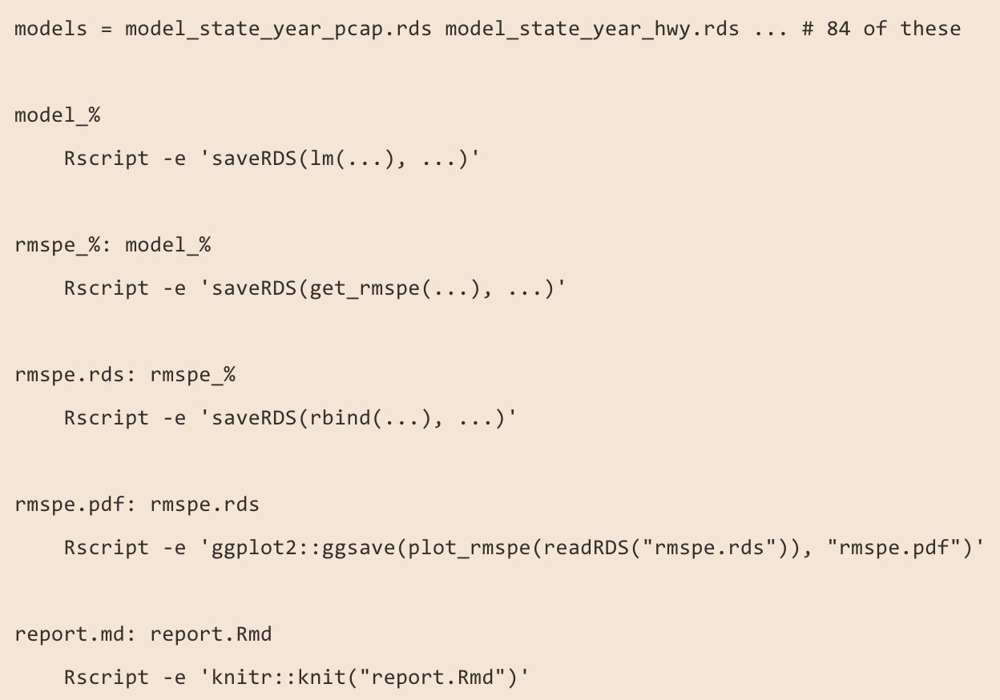

```{r setup, include=FALSE, warning=FALSE}
knitr::opts_chunk$set(echo = TRUE)
knitr::opts_chunk$set(collapse = TRUE)
options(htmltools.dir.version = FALSE)
```


###  Warning: this presentation contains less rap than you might have expected. 

I won't blame you if you want to make a quick exit.

---

class: inverse

### Quick about me

Day job: ultimate frisbee player.

For fun: Data Scientist at Earlybird Software, former co-organizer of R-Ladies Chicago.

https://github.com/aedobbyn

https://dobb.ae

@dobbleobble

---

### `drake`'s main idea

[`drake`](https://github.com/ropensci/drake) is workflow manager for your R code.

In an R pipeline, when changes occur that make the most recent results out-of-date, rebuild *only* the parts of the pipeline that need to be rebuilt.

<p align="center">

</p>

Created and maintained by [Will](https://twitter.com/wmlandau) [Landau](https://github.com/wlandau) and friends.

---

### What's the deal with the name?

.pull-left[

The name stands for:

**d**ataframes in **R** for M**ake**

or in other words, GNU Make reimagined for R.

[GNU Make](https://www.gnu.org/software/make/) uses a workflow outline file called a Makefile to specify dependencies and how targets should be rebuilt when they're out of date. 

`drake` takes that idea and implements it in a way that's more native to how we work in R.

]

.pull-right[]

---

### Nice features of `drake`
1. See how your pipeline fits together, in a tidy dataframe

--

2. Visualize dependencies in your code in graph format

--

3. Some high-performance computing advantages

--

4. Great for iteration and reproducibility; you know exactly how these results were generated

--

5. It's all in R so no writing config files! `r emo::ji("tada")`

---

### Better workflows

.pull-right[
You can avoid workflows like this, that are based on file names that could easily be out of date and rely on `source`ing the script before it.

If something breaks in `04_join.R`, do you need to go through `01_import.R`, `02_clean.R`, and `03_deep_clean.R` again?
]

.pull-left[
`01_import.R`

`02_clean.R`

`03_deep_clean.R`

`04_join.R`

`05_analyze.R`

`06_analyze_more.R`

`07_report.Rmd`
]


---

### Analogy to `knitr`

(Stolen from Will's point in his [interview on the R podcast](https://www.youtube.com/watch?v=eJQ29CLyDCs&feature=youtu.be&t=1533).)

`drake` is sort of like `knitr` in the sense that 

1) It makes your analysis reproducible and compact. You expect to be able to rerun someone's report from a single file.

2) In `knitr`, chunks can be cached if they've already been run, so they don't need to be re-run unless something in them changes.

3) When an `Rmd` is knit, a chunk successfully knitting depends on the previous chunk knitting and on any chunk that you specify a [`depedson`](https://twitter.com/drob/status/738786604731490304?lang=en) for.

---

### A few pieces of vocab

#### *targets* and *commands*

From `?drake_config`: "**Targets** are the objects and files that drake generates, and **commands** are the pieces of R code that produce them."

--

#### *plans*

**Plans** wrap up the relationship between targets and commands into a workflow representation.

In `drake` they're stored as a dataframe object, with one column for targets, and one column for their corresponding commands.

---

### More on plans

You can think of the plan as that top-level script that sources all the other scripts and runs everything, like

```{r, eval=FALSE}
source("01_import.R")
source("02_clean.R")
...
source("06_analyze_more.R")

final <- do_more_things(object_in_env)

write_out_my_results(final)
```

except that it knows about the dependencies of all objects and functions and is less cumbersome than this setup.

---

### How to `drake`

1. Store prework (loading packages and user-defined functions) in a file 
2. Store a `drake` plan in another file
3. Create the plan and run it

```{r, eval=FALSE}
source("/path/to/my/prework.R")

## Custom functions defined in prework are:
# clean_my(), analyze_my(), and report_out_my()

plan <- 
  drake_plan(
  cleaned_data = clean_my(raw_data),
  results = analyze_my(cleaned_data),
  report = report_out_my(results,
                         file_out = "/path/to/my/report.md")
)

make(plan)
```

The first run of `make(plan)` will run the plan from scratch. 

After that, `drake` will only re-run the parts of the plan that are out of date and everything downstream of that.

`drake` knows that, for example, `results` depends on `cleaned_data` because `cleaned_data` is part of the `analyze_my(cleaned_data)` command used to generate `results`.

---

### What makes a target become out of date?

1. Some part of the code used to generate that target or one of its upstream targets has changed
2. A trigger is activated (more on that later)

---

### Where is all this info stored?

**targets**

In a hidden `.drake` cache when you run `make()`. In the `.drake/data` subdirectory, targets are stored as hashed `rds` objects. [More on storage.](https://ropensci.github.io/drake/articles/storage.html)

`clean()` cleans that cache.

**dependencies**

`drake` stores a dependency graph (`igraph` object) of the plan along with a bunch of other things in `config`, which you can access with `drake_config()`.

---

### Big Idea #2

`drake` is all built around *functions* rather than sourcing scripts.
- A plan works by using functions to create targets. 
- This allows `drake` to infer dependencies of objects and functions
- Running `drake_plan` creates a dataframe relating each target to the function used to generate it.


```{r, eval=FALSE}
bad_plan <- 
  drake_plan(
    first_target = source("import.R"),
    second_target = source("clean.R")
  )
```

Sourcing files breaks the dependency structure that makes `drake` useful. 

Instead, 

```{r, eval=FALSE}
source("all_my_funs.R")

good_plan <- 
  drake_plan(
    first_target = do_stuff(my_data),
    second_target = do_more_stuff(first_target)
  )
```

This setup allows `drake` to know `first_target` needs to be built before work on `second_target` can begin.

---

### Other things `drake` can do that we won't get into

- [Generate ~ big plans ~](https://ropensci.github.io/drake/articles/best-practices.html#generating-workflow-plan-data-frames)


for analyses that require lots of different permutations of a similar analysis

(version 7.0.0 has new experimental syntax that makes it easier to create big plans)

- Support for [debugging and testing ](https://ropenscilabs.github.io/drake-manual/debug.html) plans

- Compatibility with [high performance computing](https://ropenscilabs.github.io/drake-manual/hpc.html) backends

---

### Moar Resources

- [`drake` user manual](https://ropenscilabs.github.io/drake-manual/index.html)
- [debugging drake](https://ropensci.github.io/drake/articles/debug.html)
- [Sina Rüeger's `drake` presentation](https://sinarueeger.github.io/2018/10/09/workflow/)
- [Kirill Müller's cheat sheet](https://github.com/krlmlr/drake-sib-zurich/blob/master/cheat-sheet.pdf)

---

### Our plan

I'll illustrate a way you might want to use `drake` with something that's close to home for us.

Remember the [crazy blue light](https://twitter.com/NYCFireWire/status/1078478369036165121) from late December?

The Twitter account that let us know that this wasn't in fact aliens is [NYCFireWire](https://twitter.com/NYCFireWire).

Normally they just tweet out fires and their locations in a more or less predictable pattern, i.e.

`<borough> <** some numbers **> <address> <description of fire>`

What if we were constructing an analysis of these tweets and wanted to make sure our pipeline worked end-to-end, but didn't want to unnecessarily re-run outdated parts of it unless we needed to?

---

### The Pipeline

1. Pull in tweets, either the first big batch or any new ones that show up
2. Extract addresses from the tweets (`r emo::ji("notes")` regex time `r emo::ji("notes")`)
3. Send addresses to the Google Maps API to grab their latitudes and longitudes
4. Profit

All functions stored in [`didnt_start_it.R`](https://github.com/aedobbyn/nyc-fires/blob/master/R/didnt_start_it.R).

```{r, warning=FALSE}
source(here("R", "didnt_start_it.R"))
```

Caveat is that this analysis relies on the [rtweet](https://github.com/mkearney/rtweet) and [ggmap](https://github.com/dkahle/ggmap) packages.

To be able to run it in full you'll need a [Twitter API access token](https://rtweet.info/articles/auth.html) and [Google Maps Geocoding API key](https://developers.google.com/maps/documentation/geocoding/intro#Geocoding).

---

### Grabbing tweets

- `get_seed_tweets` grabs a batch of tweets *or* reads in seed tweets from a file if the file exists
- `get_more_tweets` checks if there are new tweets and, if so, pulls in the right number of them
- `get_tweets` runs `get_seed_tweets` if given a null `tbl` argument, otherwise runs `get_more_tweets`

```{r, include=FALSE}
get_seed_tweets

get_more_tweets

get_tweets
```

```{r}
get_tweets()
```

---

### Grabbing tweets

The most recent tweets from NYCFireWire:

```{r}
get_tweets() %>% 
  select(text) %>% 
  print(n = nrow(.))
```


---

### Grabbing tweets

Starting with an old tweet ID, we can first grab a 10 tweets older than `old_tweet_id` and then, running the same function again, add 5 of the most recent tweets to our dataframe.

```{r}
old_tweet_id <- "1084619203167031297" # Random tweet from a while ago so what we can set a max id in the past

seed_tweets <- 
  get_tweets(
    n_tweets_seed = 10,
    max_id = old_tweet_id
  )

(full_tweets <- 
  get_tweets(seed_tweets, n_tweets_reup = 5,
             output_path = here("data", "raw", "fires.csv")))
```

---

### Getting addresses

```{r, include=FALSE}
borough_reg

clean_borough

pull_addresses
```

```{r}
get_tweets() %>% 
  pull_addresses() %>% 
  select(street, borough, address, text)
```

---

### Getting lat and long

Then we can use the [`geocode`](https://www.rdocumentation.org/packages/ggmap/versions/2.6.1/topics/geocode) function (along with a [Google Maps](https://cloud.google.com/maps-platform/) API key) from the `ggmap` package to attach the latitude and longitude to each address, if Google can find it. (Otherwise we're returned `NA`s.)

```{r, include=FALSE}
geo_to_list

truncate_lat_long

get_lat_long
```

```{r}
get_tweets(n_tweets_seed = 5) %>% 
  pull_addresses() %>% 
  get_lat_long()
```


That's our main pipeline. We can do a few bits of analysis of the data after that.

---

### Late pipeline

Later in the pipeline we can join 

```{r, eval=FALSE}
nyc <-
  ggplot2::map_data("state", region = "new york") %>%
  truncate_lat_long(digits = 1) %>%
  as_tibble()
```


or `count_fires`, summing up the total number of fires per `lat`-`long` combo.

```{r}
get_tweets(n_tweets_seed = 5) %>% 
  pull_addresses() %>% 
  get_lat_long() %>% 
  count_fires()
```


---

### Quick benchmark

Even though it didn't take too long to pull 5 tweets from Twitter and send 5 addresses to Google Maps, we wouldn't want to re-run this part of the pipeline every time we changed an analysis step.


```{r}
b_mark <-
  bench::mark({
    get_tweets(n_tweets_seed = 1) %>% 
    pull_addresses() %>% 
    get_lat_long()
})

b_mark %>% 
  select(median)
```


---

### Live coding time!

The `rtweet` package also supports posting tweets, so we can test out whether our trigger successfully pulls in new tweet by posting ourselves with a

`r emo::ji("fire")` **[burner account!](https://twitter.com/didntstartit)** `r emo::ji("fire")`

